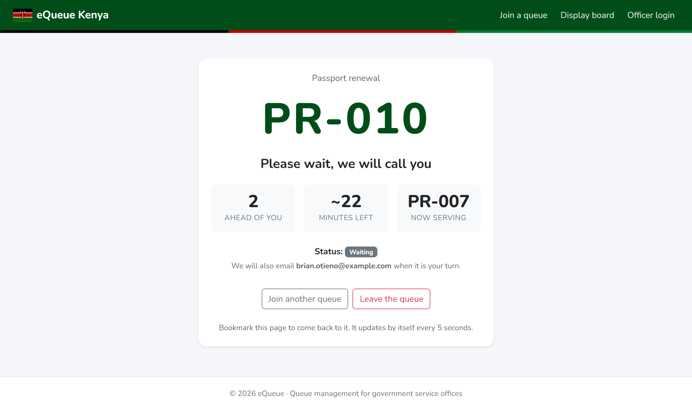
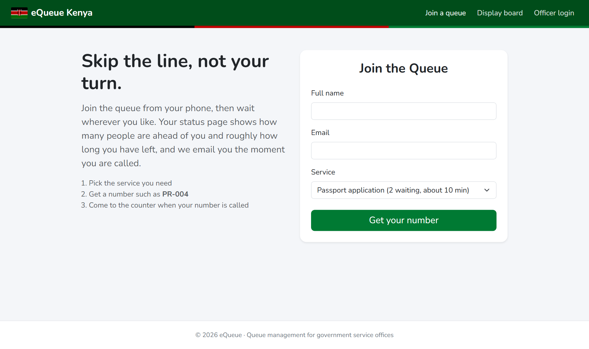
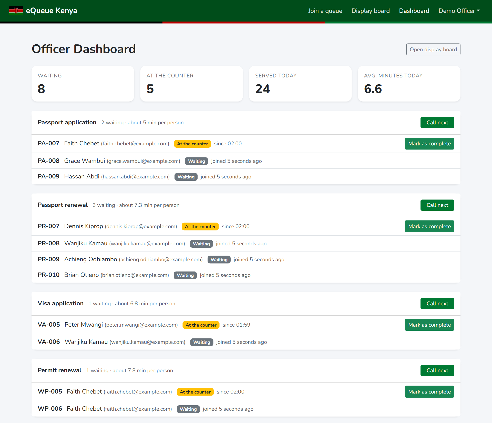
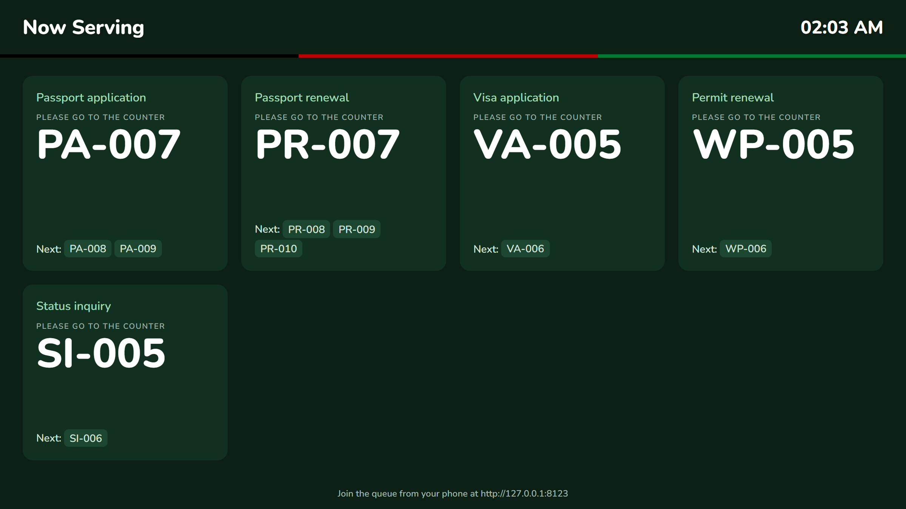
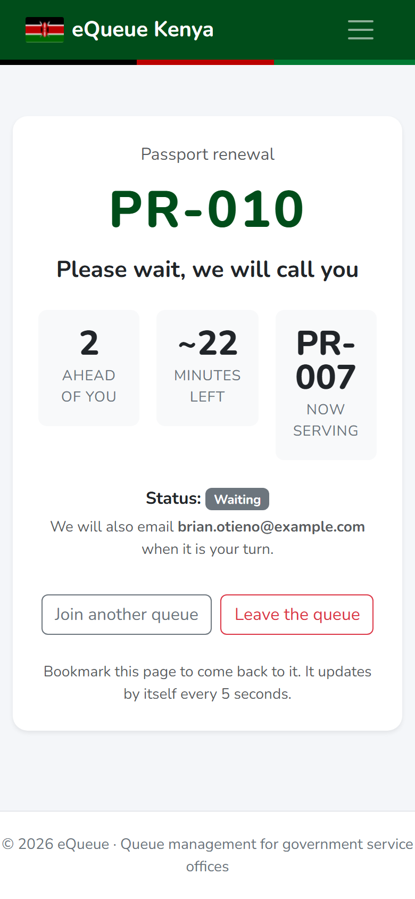
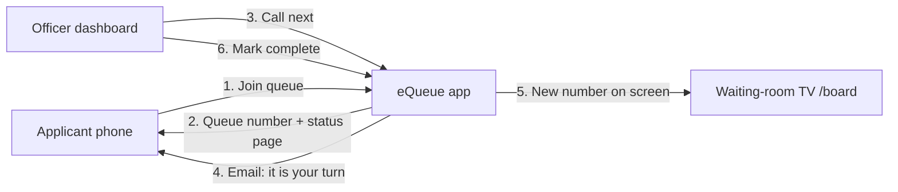
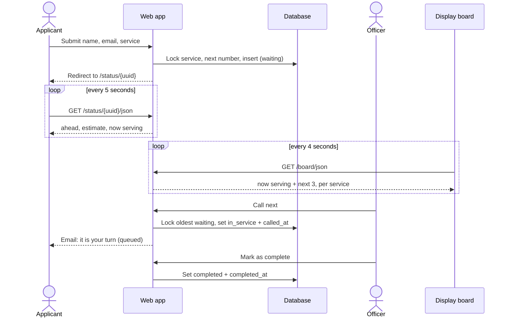
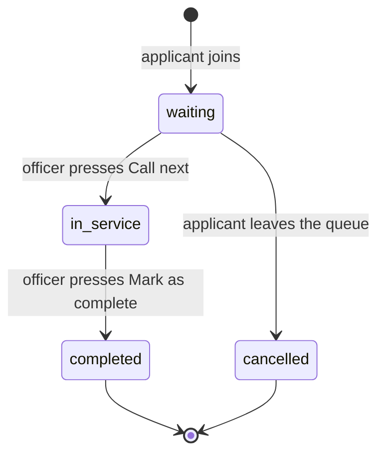
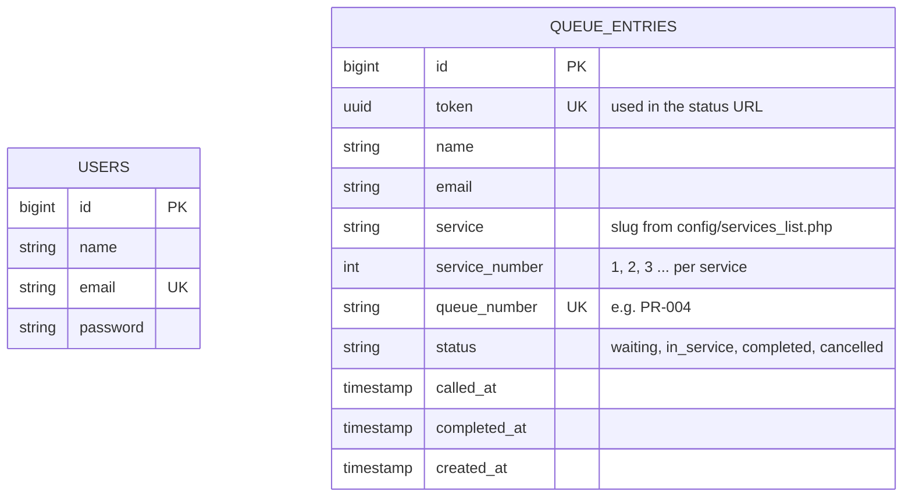
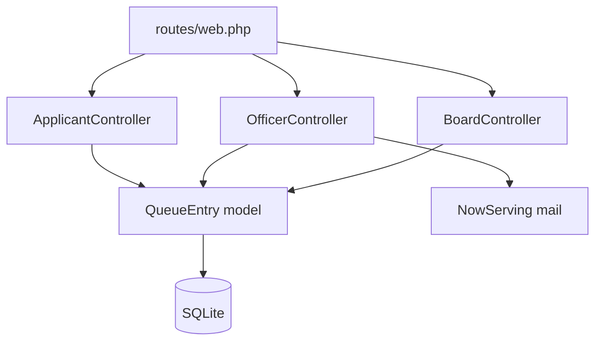

# eQueue

[](https://github.com/kinuthia-mark/Equeue-project/actions/workflows/tests.yml)


**A digital queue for government service offices** (passports, visas, permits). Applicants join from their phone and follow their place in line live. Officers call the next person from a dashboard, a TV in the waiting room shows who is being served, and the applicant gets an email when it is their turn.

Nobody has to stand in a physical line, and nobody misses their turn because they stepped outside.

<p align="center">
  
</p>

---

## Contents

- [Features](#features)
- [Screenshots](#screenshots)
- [Quick start with Docker](#quick-start-with-docker)
- [Local setup without Docker](#local-setup-without-docker)
- [How it works](#how-it-works)
- [Wait time estimates](#wait-time-estimates)
- [Data model](#data-model)
- [Routes and JSON endpoints](#routes-and-json-endpoints)
- [Project layout](#project-layout)
- [Configuration](#configuration)
- [Tests and CI](#tests-and-ci)
- [Design decisions](#design-decisions)
- [Ideas for next steps](#ideas-for-next-steps)

---

## Features

**For applicants (no account needed)**

- **Join a queue online.** Pick a service and get a number such as `PR-004`. The form already shows how many people are waiting for each service and roughly how long it will take.
- **Live status page.** Your number, how many people are ahead of you, an estimated wait in minutes, and who is being served now. It updates itself every 5 seconds and has a mobile-first layout.
- **Email when called,** sent through Laravel's queue so a mail problem never blocks the officer.
- **Leave the queue** if plans change, so everyone behind you moves up.

**For officers**

- **Dashboard** with today's numbers (waiting, at the counter, served today, average minutes per person) and one panel per service.
- **Call next** takes the oldest waiting person, and **Mark as complete** finishes them. Each step is timestamped.
- **Officer accounts are created from the command line.** There is no public sign-up page.

**For the waiting room**

- **Display board** at `/board`, built for a TV: big numbers, high contrast, a clock, the next three numbers per service, and a flash when a new number is called. It shows queue numbers only, never names or emails.

**Engineering**

- 25 feature tests (73 assertions), run on PHP 8.2 and 8.3 on every push
- Laravel Pint code style check in CI
- Docker image with a one-command demo, also started and checked in CI
- Race-condition safe: queue numbers and "call next" both run inside locked database transactions

---

## Screenshots

| Join the queue | Officer dashboard |
|---|---|
|  |  |

**Waiting-room display board**



<p align="center">
  <b>Status page on a phone</b><br>
  
</p>

---

## Quick start with Docker

```bash
git clone https://github.com/kinuthia-mark/Equeue-project.git
cd Equeue-project
docker compose up --build
```

Open <http://localhost:8000>. The compose file loads demo data: five services with sample queues and a demo officer, **officer@example.com** / **password**. The display board is at <http://localhost:8000/board>.

The SQLite database lives in a named volume (`equeue-db`), so queues survive a restart. `docker compose down -v` resets everything.

> The container runs `php artisan serve`, which is fine for demos and evaluation. For production, run PHP-FPM behind Nginx and set `APP_ENV=production`.

---

## Local setup without Docker

Requirements: PHP 8.2+ with the `sqlite3` extension, and Composer.

```bash
git clone https://github.com/kinuthia-mark/Equeue-project.git
cd Equeue-project

composer install
cp .env.example .env
php artisan key:generate

touch database/database.sqlite
php artisan migrate --seed

php artisan serve
```

Open <http://localhost:8000>.

### Officer accounts

Public registration is disabled so strangers cannot control your queues.

- **Local development:** `--seed` creates the demo officer (`officer@example.com` / `password`) and sample queues. This only happens when `APP_ENV=local`.
- **Anywhere else:** create officers from the command line. You will be asked for a password.

```bash
php artisan officer:create jane@office.go.ke --name="Jane Wanjiru"
```

Officers log in at `/login` and land on `/officer`.

---

## How it works

Three kinds of screen use the same data: the applicant's phone, the officer's dashboard and the waiting-room TV.



### Step by step



### Life of a queue entry



---

## Wait time estimates

The estimate on the status page is:

```
minutes left = (people ahead + 1 if someone is at the counter) × average service time
```

The **average service time** for a service is the mean of `completed_at - called_at` over the 20 most recently completed entries for that service. Until a service has any history, it uses `QUEUE_DEFAULT_SERVICE_MINUTES` (5 by default). Each service learns its own pace, so a quick status inquiry does not inflate the estimate for a passport application.

The logic lives in `QueueEntry::averageServiceMinutes()` and `QueueEntry::estimatedWaitMinutes()` and is covered by tests.

---

## Data model



`users` are officers. `queue_entries` are applicants. The two tables are deliberately independent: applicants never have an account. There is an index on `(service, status)` because almost every query filters on both.

---

## Routes and JSON endpoints

| Method | Path | Who | Purpose |
|---|---|---|---|
| GET | `/` | Public | Join form with queue lengths |
| POST | `/submit` | Public, max 10 per minute per IP | Join a queue |
| GET | `/status/{token}` | Public, needs the UUID | Live status page |
| GET | `/status/{token}/json` | Public, needs the UUID | Status data polled by the page |
| POST | `/status/{token}/leave` | Public, needs the UUID | Leave the queue |
| GET | `/board` | Public | Waiting-room display |
| GET | `/board/json` | Public | Display data polled by the board |
| GET | `/officer` | Officer | Dashboard |
| POST | `/officer/call-next` | Officer | Call the oldest waiting person for a service |
| POST | `/officer/complete/{token}` | Officer | Finish the person at the counter |
| GET | `/up` | Public | Health check (used by Docker) |

Example `/status/{token}/json` response:

```json
{
  "status": "waiting",
  "status_label": "Waiting",
  "ahead": 1,
  "now_serving": "PR-007",
  "estimated_wait_minutes": 11
}
```

Example `/board/json` response (one service shown):

```json
{
  "services": [
    {
      "slug": "passport-renewal",
      "label": "Passport renewal",
      "now_serving": "PR-007",
      "up_next": ["PR-008", "PR-009"],
      "waiting": 2
    }
  ],
  "updated_at": "2026-10-06T09:15:00+03:00"
}
```

---

## Project layout



| Path | Purpose |
|------|---------|
| `routes/web.php` | All routes |
| `app/Http/Controllers/ApplicantController.php` | Join form, status page, leave queue |
| `app/Http/Controllers/OfficerController.php` | Dashboard and stats, call next, complete |
| `app/Http/Controllers/BoardController.php` | Waiting-room display and its JSON feed |
| `app/Models/QueueEntry.php` | Statuses, position, average service time, wait estimate |
| `app/Mail/NowServing.php` | The "it's your turn" email (queued) |
| `app/Console/Commands/CreateOfficer.php` | `php artisan officer:create` |
| `config/services_list.php` | Services, number prefixes, default service minutes |
| `database/seeders/DatabaseSeeder.php` | Demo officer and realistic sample queues (local only) |
| `resources/views/board.blade.php` | The TV display, a standalone page |
| `tests/Feature/` | `QueueTest` (core flow) and `TimingAndBoardTest` (estimates, leaving, board) |
| `Dockerfile`, `docker-compose.yml`, `docker/entrypoint.sh` | Container build and first-start setup |

---

## Configuration

**Services.** Edit `config/services_list.php`. The key is stored in the database, `label` is shown to people, and `prefix` starts the queue number.

```php
'visa-application' => ['label' => 'Visa application', 'prefix' => 'VA'],
```

**Environment variables** (see `.env.example`):

| Variable | Default | Purpose |
|---|---|---|
| `APP_TIMEZONE` | `Africa/Nairobi` | Times on the dashboard and in "served today" |
| `QUEUE_DEFAULT_SERVICE_MINUTES` | `5` | Estimate used before a service has history |
| `MAIL_MAILER` | `log` | `log` writes emails to `storage/logs/laravel.log`. Set the `MAIL_*` values for real email |
| `QUEUE_CONNECTION` | `sync` | Use `database` in production and run `php artisan queue:work` |
| `DEMO_DATA` | `0` | Docker only: `1` loads the demo officer and sample queues |

---

## Tests and CI

```bash
php artisan test
vendor/bin/pint --test
```

| Test file | Covers |
|---|---|
| `QueueTest` | Joining, validation, per-service numbering, unguessable status links, disabled registration, login, calling the oldest entry, email, completing, mail failures |
| `TimingAndBoardTest` | `called_at` / `completed_at` timestamps, average service time and its fallback, wait estimates, leaving the queue, calling skips people who left, board shows no personal data, dashboard stats, queue lengths on the join form |

GitHub Actions (`.github/workflows/tests.yml`) runs on every push and pull request:

1. **PHPUnit** on PHP 8.2 and 8.3
2. **Laravel Pint** style check
3. **Docker:** builds the image, starts it with demo data, waits for `/up`, then requests `/`, `/board` and `/board/json`

---

## Design decisions

| Problem | What the app does |
|---------|-------------------|
| Anyone could register as an officer | Registration route removed, officers created by command |
| Status URL used `/status/1`, so others' entries could be browsed | Links use a random UUID token |
| Two applicants could get the same number | Numbers are issued inside a database transaction, sequential per service |
| Two officers could call the same person | The next entry is locked while it is being called |
| A mail error could break "Call next" | Email is queued and failures are logged, not fatal |
| The waiting-room screen is visible to everyone | The board and its JSON only contain queue numbers |
| A fixed "5 minutes per person" is wrong for most services | Each service's estimate comes from its own recent history |
| Polling could overload the server | The JSON endpoints run a handful of indexed `COUNT`/`SELECT` queries |

---

## Ideas for next steps

- SMS notifications (Africa's Talking) for applicants without email
- Multiple counters per service, so each officer serves from their own desk
- "Almost your turn" notification when two people are ahead
- Admin screen to manage services and officers
- Daily reports: busiest hours, average wait per service

---

## License

MIT. See [LICENSE](LICENSE).

## Author

**Mark Kinuthia** - [github.com/kinuthia-mark](https://github.com/kinuthia-mark)
