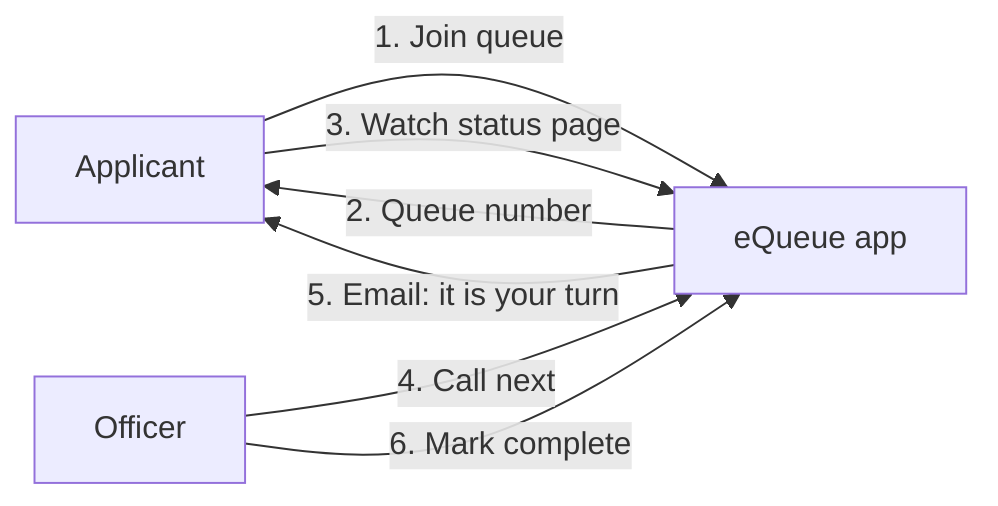
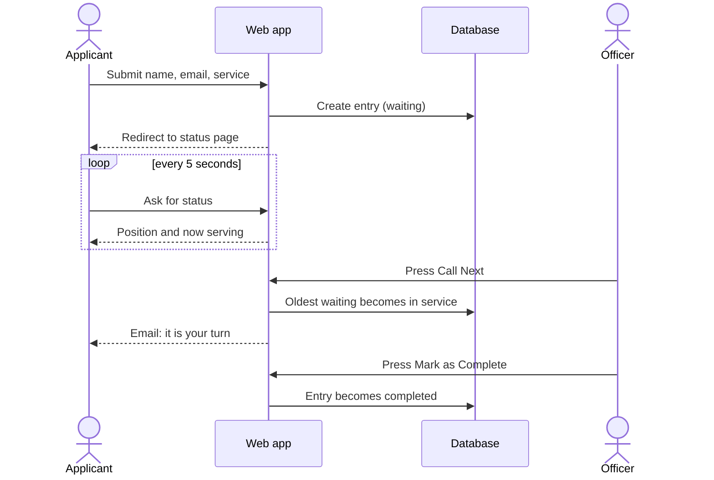
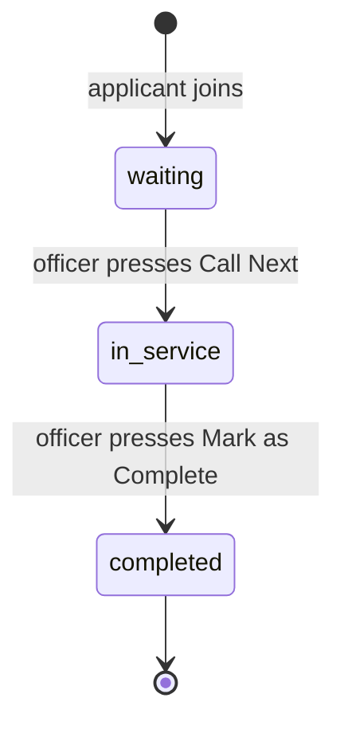
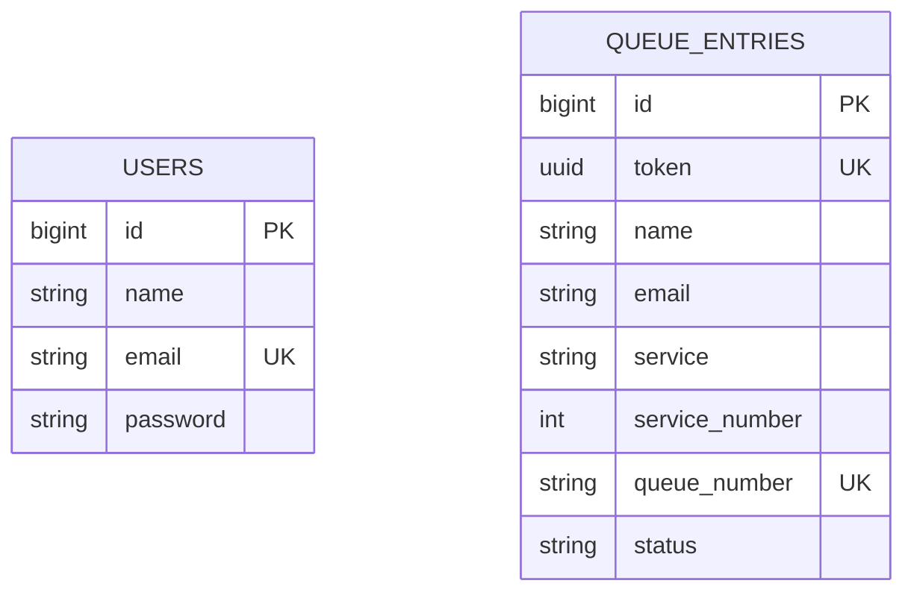
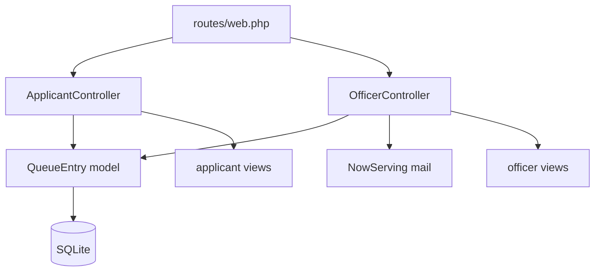

# eQueue

[](https://github.com/kinuthia-mark/Equeue-project/actions/workflows/tests.yml)


A digital queue management system for government service offices (passports, visas, permits).
Applicants join a queue from their phone and watch their place in line update live.
Officers call the next person from a dashboard, and the applicant is emailed when it is their turn.

Built with **Laravel 12**, **Bootstrap 5** and **SQLite**.

## Features

- **Join a queue online.** Pick a service, get a number such as `PR-004`.
- **Live status page.** Shows your number, how many people are ahead of you, and who is being served now. It refreshes itself every 5 seconds.
- **Officer dashboard.** One queue per service, with *Call Next* and *Mark as Complete*.
- **Email notification** when you are called (queued, so a mail problem never blocks the officer).
- **Secure by default.** No public sign-up, unguessable status links, CSRF protection, rate-limited joining.
- **Tested.** 14 feature tests run on every push through GitHub Actions, on PHP 8.2 and 8.3.

## How it works

Two kinds of people use the system. Applicants need no account. Officers log in.



### Step by step



### Life of a queue entry



## Data model



`users` are officers. `queue_entries` are applicants waiting or being served. The two tables are intentionally independent: applicants never have an account.

## Project layout



| Path | Purpose |
|------|---------|
| `routes/web.php` | All routes |
| `app/Http/Controllers/ApplicantController.php` | Join queue and status pages |
| `app/Http/Controllers/OfficerController.php` | Dashboard, call next, complete |
| `app/Models/QueueEntry.php` | Statuses, queue position logic |
| `app/Mail/NowServing.php` | The "it's your turn" email |
| `app/Console/Commands/CreateOfficer.php` | `php artisan officer:create` |
| `config/services_list.php` | The services offered and their number prefixes |
| `tests/Feature/QueueTest.php` | Feature tests |

## Getting started

Requirements: PHP 8.2+ with the `sqlite3` extension, and Composer.

```bash
git clone https://github.com/kinuthia-mark/Equeue-project.git
cd Equeue-project

composer install
cp .env.example .env
php artisan key:generate

touch database/database.sqlite
php artisan migrate --seed

php artisan serve
```

Open <http://localhost:8000>.

### Officer accounts

Public registration is disabled so that strangers cannot control your queues.

- **Local development:** `--seed` creates a demo officer, `officer@example.com` / `password`. This account is only created when `APP_ENV=local`.
- **Anywhere else:** create an officer from the command line. You will be asked for a password.

```bash
php artisan officer:create jane@office.go.ke --name="Jane Wanjiru"
```

Officers log in at `/login` and land on `/officer`.

## Configuration

**Services.** Edit `config/services_list.php`. The key is stored in the database, `label` is shown to people, and `prefix` starts the queue number.

```php
'visa-application' => ['label' => 'Visa application', 'prefix' => 'VA'],
```

**Email.** By default `MAIL_MAILER=log`, so emails are written to `storage/logs/laravel.log`. For real email, set the `MAIL_*` values in `.env`.

**Queue driver.** `QUEUE_CONNECTION=sync` sends mail immediately, which is fine for development. In production use `database` and keep a worker running so emails never slow down the officer:

```bash
php artisan queue:work
```

## Tests

```bash
php artisan test
```

The tests cover joining, validation, per-service numbering, unguessable status links, disabled registration, login, calling the oldest entry, email, completing, and mail failures.

## Design decisions

| Problem | What the app does |
|---------|-------------------|
| Anyone could register as an officer | Registration route removed, officers created by command |
| Status URL used `/status/1`, so others' entries could be browsed | Links use a random UUID token |
| Two applicants could get the same number | Numbers are issued inside a database transaction, sequential per service |
| Two officers could call the same person | The next entry is locked while it is being called |
| A mail error could break "Call Next" | Email is queued and failures are logged, not fatal |

## Ideas for next steps

- Estimated waiting time from average service duration
- SMS notifications
- Multiple counters, so each officer serves from their own desk
- A public "now serving" display board for the waiting room
- Admin screen to manage services and officers

## License

MIT. See [LICENSE](LICENSE).

## Author

**Mark Kinuthia** - [github.com/kinuthia-mark](https://github.com/kinuthia-mark)
